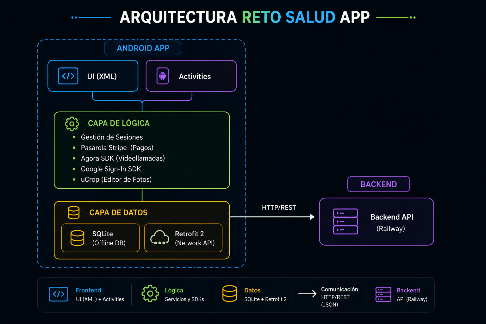
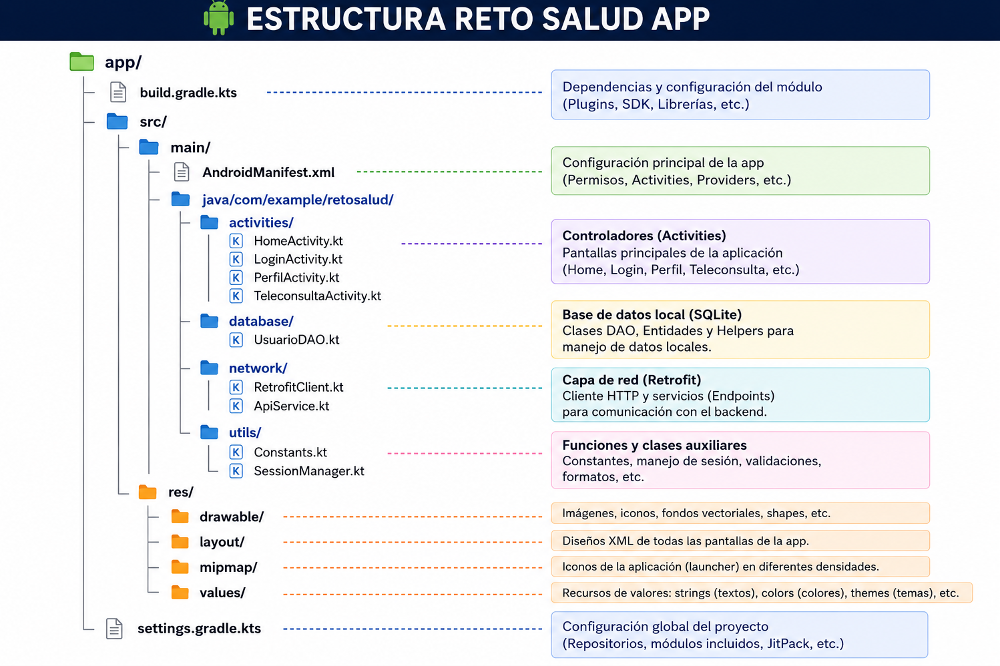

# RETO SALUD - Aplicación Android

<p align="center">
  <picture>
    <source media="(prefers-color-scheme: dark)" srcset="docs/logo_dark.png">
    <source media="(prefers-color-scheme: light)" srcset="docs/RETO%20SALUD%20APP.png">
    
  </picture>
</p>

Aplicación móvil nativa para telemedicina y gestión de citas médicas, desarrollada en **Android (Java)**. Este repositorio contiene todo el código fuente del cliente (Frontend móvil), el cual se encarga de la interfaz gráfica, la gestión de videollamadas, el procesamiento de pagos y el almacenamiento offline.

## Arquitectura de la Aplicación Android

La aplicación sigue una arquitectura enfocada en Activities y componentes modulares para facilitar la escalabilidad y mantener responsabilidades separadas. Se nutre de un API REST externa para la persistencia global, pero mantiene su propia base de datos local SQLite para asegurar una experiencia **Offline-First** en pantallas clave.



## Funcionalidades Principales

- **Autenticación:** Registro e inicio de sesión tradicional y con cuenta de Google.
- **Catálogo Médico:** Exploración de especialidades médicas y perfiles de doctores.
- **Gestión de Citas:** Proceso de agendamiento de citas médicas.
- **Modo Offline-First:** Permite ver doctores y perfil sin internet mediante SQLite.
- **Pagos Seguros:** Integración con Stripe para cobros de teleconsultas.
- **Telemedicina:** Integración con Agora SDK para videollamadas en tiempo real.
- **Perfil de Usuario:** Gestión de perfil personal y edición de datos.
- **Edición de Imágenes:** Cambio de foto de perfil con recorte y escalado local (uCrop).


## Stack Tecnológico Android

| Herramienta | Propósito |
|-------------|-----------|
| **Java** | Lenguaje principal de desarrollo |
| **XML** | Diseño de interfaces de usuario (Layouts) |
| **SQLite** | Base de datos local (mediante SQLiteOpenHelper) para gestión de usuarios offline |
| **Retrofit 2 & Gson** | Consumo de la API REST externa y lectura de datos JSON |
| **Agora Video SDK** | Integración nativa de telemedicina y videollamadas en tiempo real |
| **Stripe SDK** | Procesamiento de pagos seguro integrado en la UI |
| **Google Play Services** | Autenticación nativa mediante cuentas de Google |
| **uCrop** | Librería de edición de fotos (escalado y rotación de avatar) |

## Estructura del Proyecto

El código fuente sigue las convenciones estándar de Android Studio:



## Estructura de Base de Datos Local (SQLite)

El sistema utiliza SQLite para garantizar disponibilidad offline mediante las siguientes tablas principales:

| Tabla | Descripción | Campos Clave |
|---|---|---|
| `usuarios` | Almacena los datos del paciente | `nombre`, `correo`, `password`, `telefono` |
| `especialidades` | Catálogo local de especialidades médicas | `id`, `nombre` |
| `doctores` | Perfiles de los médicos | `horario`, `rating`, `biografia`, `imagen` |
| `citas` | Registro local de las citas médicas agendadas | `fecha`, `hora`, `estado` |


## Constantes y Credenciales Requeridas

En la app Android, las claves se manejan a través de clases de configuración (`Constants.java`, `strings.xml`, etc.):

| Constante | Descripción | Ejemplo |
|---|---|---|
| `AGORA_APP_ID` | App ID del proyecto en Agora Console para videollamadas | `a1b2c3d...` |
| `STRIPE_PUBLISHABLE_KEY` | Clave pública para renderizar la hoja de pagos | `pk_test_...` |
| `GOOGLE_CLIENT_ID` | Web Client ID de Google Cloud para Google Sign-In | `123.apps.googleusercontent.com` |
| `BASE_URL` | Endpoint base para Retrofit (API REST) | `https://api.tu-dominio.com/` |

## Consumo de API REST (Retrofit 2)

La aplicación móvil se comunica con el Backend mediante **Retrofit 2**. A continuación, se detallan los Web Services principales que consume la app:

| Módulo | HTTP | Endpoints Principales | Propósito |
|---|---|---|---|
| **Autenticación** | `POST` | `/auth/login`, `/registro`, `/google` | Inicio de sesión, registro y validación (Retorna JWT). |
| **Catálogo Médico** | `GET` | `/api/medicos`, `/disponibilidades` | Lista de doctores, especialidades y horarios de atención. |
| **Gestión de Citas** | `POST`, `GET` | `/api/citas`, `/citas/usuario/{id}` | Agendamiento de citas y consulta de próximas atenciones. |
| **Pagos (Stripe)** | `POST` | `/api/create-payment-intent`, `/pagos` | Generación de intención de pago cifrada y registro de transacción. |
| **Perfil e Imágenes**| `GET`, `PUT`, `POST`| `/api/usuarios/{id}`, `/foto` | Edición de datos personales y subida de avatar (*Multipart*). |
| **Historial Clínico**| `GET` | `/api/historiales/paciente/{id}` | Consulta de atenciones, diagnósticos y recetas previas. |
| **Telemedicina** | `GET` | `/api/teleconsulta/config` | Obtención de tokens dinámicos para videollamadas con Agora. |

## Configuración de Servicios Externos

### Agora SDK (Videollamadas)

1. Crear cuenta en [Agora Console](https://console.agora.io/)
2. Crear un proyecto y obtener el **App ID**
3. Configurar tu `appId` en las constantes de tu app (o inyectarlo dinámicamente).

### Stripe SDK (Pagos)

1. Crear cuenta en [Stripe](https://stripe.com/)
2. Obtener la clave pública (`pk_test_...`) desde el Dashboard.
3. Integrar la hoja de pagos en `PagoActivity.java`. El procesamiento pesado lo maneja el Backend de Railway.

### Google Sign-In (Autenticación)

1. Configurar tu app Android en la [consola de Google Cloud](https://console.cloud.google.com/) (con su SHA-1).
2. Obtener el `Client ID` Web (terminado en `apps.googleusercontent.com`).
3. Actualizar el ID en `LoginActivity.java` al configurar `GoogleSignInOptions`.

### uCrop (Editor de Imágenes)

1. Extraer la librería localmente desde su [repositorio oficial en GitHub](https://github.com/Yalantis/uCrop) (`com.github.yalantis:ucrop`).
2. Habilitar **JitPack** en `settings.gradle.kts` e importar la dependencia en `build.gradle.kts`.
3. Declarar `UCropActivity` en el `AndroidManifest.xml` para habilitar la ventana de edición.

## Prerrequisitos para Compilar

- **Android Studio**.
- SDK de Android (API Mínima 24+ recomendada).
- Conexión a internet para la descarga de dependencias en Gradle.

## Instalación y Ejecución Local

### 1. Clonar el Repositorio

```bash
git clone https://github.com/AstroLopitecus123/RETO-SALUD-App.git
cd RETO-SALUD-App
```

### 2. Sincronizar Gradle

1. Abre Android Studio.
2. Ve a **File > Open** y selecciona la carpeta.
3. Espera a que Gradle descargue todas las librerías (`io.agora.rtc`, `com.github.yalantis:ucrop`, etc.).

### 3. Compilar y Emular

Conecta tu dispositivo Android mediante depuración USB o inicia un Emulador virtual desde el *Device Manager* de Android Studio, y presiona el botón **Run**.

---
*Repositorio exclusivo para el cliente móvil Android de RETO SALUD.*
